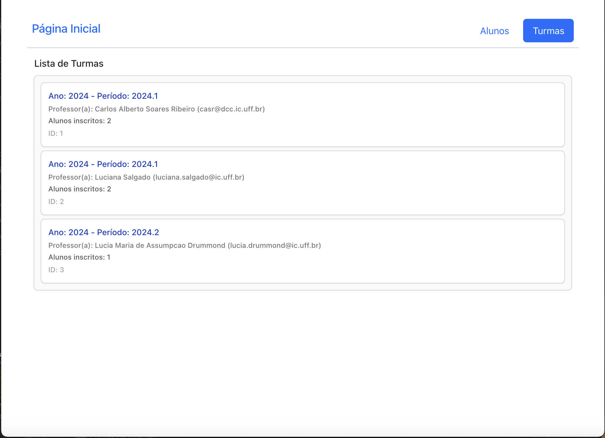
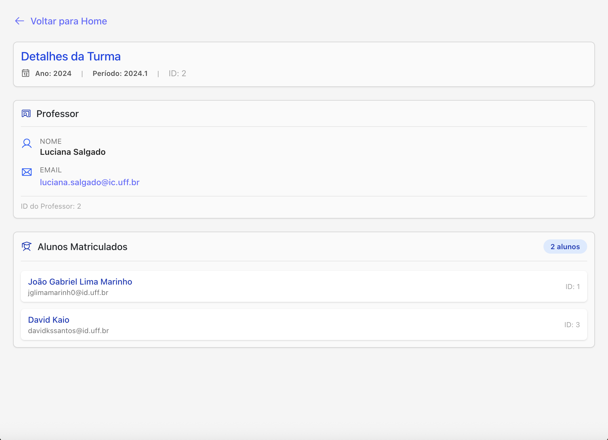

# Class Management System

A modern web application for managing university classes, developed for the Web Development course at UFF (Universidade Federal Fluminense).

## About the Project

This project is a class management system that allows users to view and manage information about different university classes. Built with React, TypeScript, and Vite, it provides a clean and intuitive interface for browsing class lists and viewing detailed information about each class.

## Features

### Class List View


- Display all available classes in a organized list format
- Quick overview of class information including:
  - Class code and name
  - Schedule information
  - Teacher name
  - Department/Course information
- Responsive design that works on different screen sizes

### Class Details View


- Detailed information about a specific class
- Complete schedule breakdown
- Teacher information and contact details
- Course syllabus and requirements
- Student enrollment information
- Prerequisites and related courses

## Technologies Used

- **React 18** - UI library for building user interfaces
- **TypeScript** - Type-safe JavaScript
- **Vite** - Fast build tool and development server
- **React Router** - Client-side routing
- **CSS Modules** - Component-scoped styling

## Getting Started

### Prerequisites

- Node.js (v18 or higher)
- npm or yarn

### Installation

```bash
# Clone the repository
git clone <repository-url>

# Navigate to project directory
cd projeto-3

# Install dependencies
npm install

# Start development server
npm run dev
```

### Build for Production

```bash
npm run build
```

## Project Structure

```
projeto-3/
├── src/
│   ├── components/     # React components
│   ├── pages/         # Page components
│   ├── styles/        # CSS modules
│   └── App.tsx        # Main application component
├── readme/            # Documentation images
└── public/           # Static assets
```

## Development

This template uses:

- [@vitejs/plugin-react](https://github.com/vitejs/vite-plugin-react/blob/main/packages/plugin-react) - Uses Babel for Fast Refresh
- ESLint for code quality
- TypeScript for type safety

## Course Information

**Course**: Web Development (Desenvolvimento Web)  
**Institution**: UFF - Universidade Federal Fluminense  
**Year**: 2024

## License

This project is part of academic coursework at UFF.
